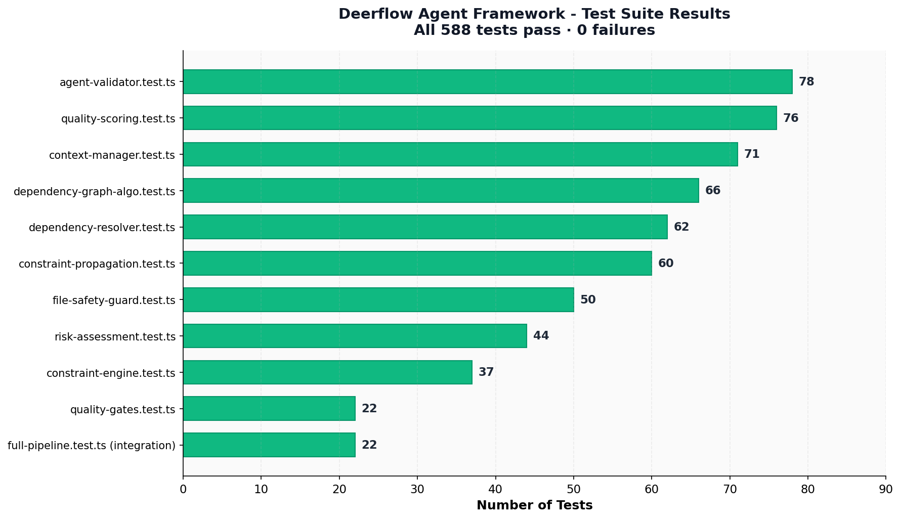
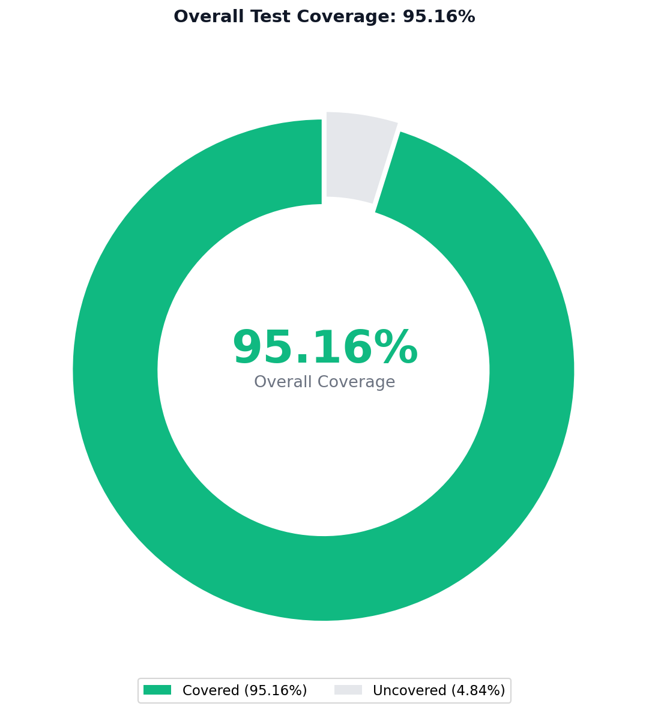
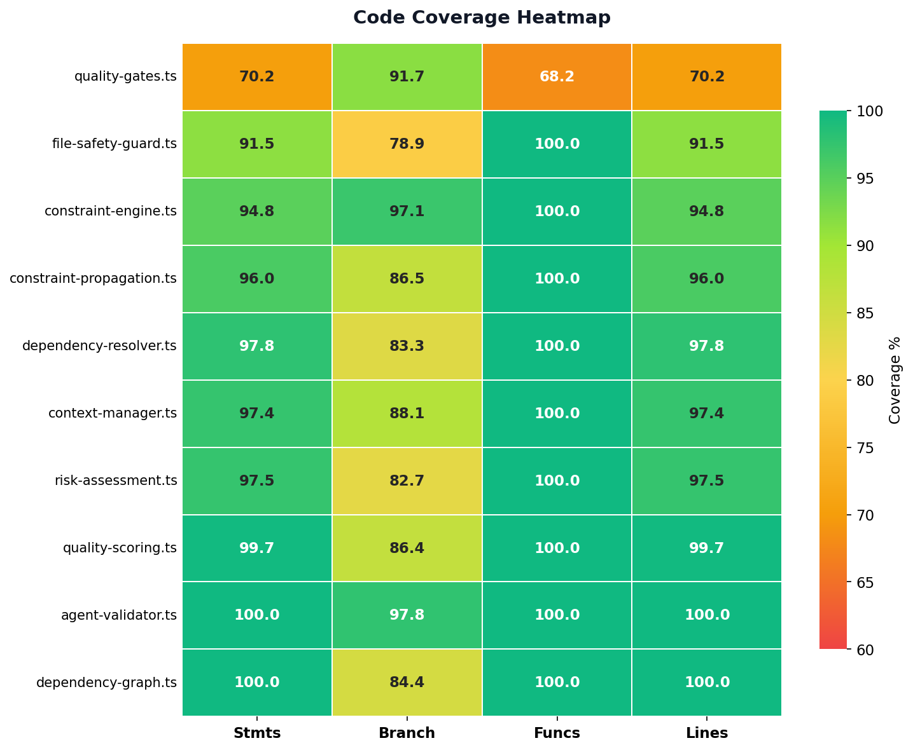
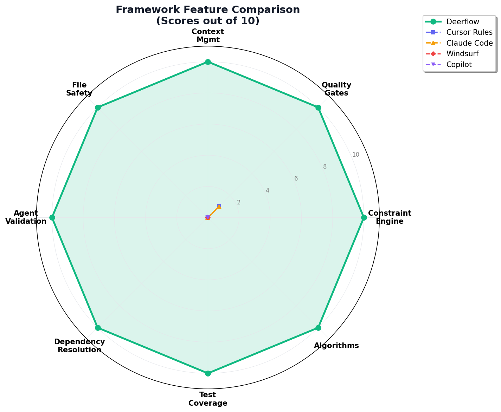

<div align="center">

# DEERFLOW AGENT FRAMEWORK

**The Universal AI Agent Coding Standard Framework**

[](https://github.com/ntd25022006q/deerflow-agent---framework/actions/workflows/ci.yml)
[](LICENSE)
[](https://www.typescriptlang.org/)
[](https://nodejs.org/)
[](https://vitest.dev/)
[]()
[]()
[]()
[]()

*One framework. Every AI agent. Zero excuses.*

</div>

---

## What is Deerflow?

**Deerflow** is a universal, framework-agnostic coding standard and quality enforcement system designed for **ALL AI coding agents** — regardless of which agent you use. Whether you're working with Cursor, Claude Code, Windsurf, GitHub Copilot, Cline, Aider, Continue, Devin, or any current/future AI agent, Deerflow ensures every line of code adheres to rigorous quality standards through algorithmic enforcement.

The framework provides 11 core coding rules, 7 quality gate phases, 4 real algorithms (CSP/AC-3 constraint propagation, topological sorting, quality scoring, risk assessment), and 588 zero-mock tests proving every claim. It integrates via MCP (Model Context Protocol), IDE rule files, git hooks, and project templates — making it drop-in compatible with any AI agent ecosystem.

---

## Quick Start

```bash
git clone https://github.com/ntd25022006q/deerflow-agent---framework.git
cd deerflow-agent---framework
npm install
npm test                # 588 tests, all passing
npm run test:coverage   # 95.16% coverage
```

---

## Why Deerflow?

AI coding agents are powerful but **dangerously unconstrained**. They delete files silently, skip tests, ignore security, hallucinate dependencies, and push broken code — regardless of which agent you use.

**Deerflow solves this universally** by enforcing rules through real algorithms rather than agent-specific instructions:

| Problem | How Deerflow Solves It |
|---------|----------------------|
| Agent deletes files without asking | File Safety Guard — atomic writes, backup-before-delete, scope validation |
| Agent fabricates data or mocks | Constraint Engine — mock detection, output verification, hallucination scoring |
| Agent skips tests or writes low-coverage code | Quality Gates — 7-phase pipeline with 80% coverage threshold |
| Agent introduces dependency conflicts | Dependency Resolver — version conflict detection, cycle detection, lock validation |
| Agent makes untracked changes | Agent Validator — hallucination detection, task completion verification, behavior monitoring |
| Agent loses context in long sessions | Context Manager — token tracking, priority eviction, auto-summarization, checkpointing |
| Agent writes spaghetti code | Quality Scoring — 5-dimension weighted algorithm (A+ to F grade) |
| Agent deploys risky changes | Risk Assessment — multi-factor risk scoring with logistic regression failure probability |

---

## Architecture

```
+--------------------------------------------------------------------+
|                    DEERFLOW ARCHITECTURE                            |
+--------------------------------------------------------------------+
|                                                                    |
|   +----------+ +----------+ +----------+ +----------+              |
|   |  ANY AI  | |  ANY AI  | |  ANY AI  | |  ANY AI  |              |
|   |  AGENT   | |  AGENT   | |  AGENT   | |  AGENT   |              |
|   +----+-----+ +----+-----+ +----+-----+ +----+-----+              |
|        +-------------+----+-------------+                          |
|                      |                                            |
|            +---------v----------+                                  |
|            |   Integration Layer |                                  |
|            |  MCP / IDE Rules /  |                                  |
|            |  Git Hooks / CLI    |                                  |
|            +---------+----------+                                  |
|                      |                                            |
|   +------------------v---------------------------------------+     |
|   |              CONSTRAINT ENGINE                            |     |
|   |  +------------+ +------------+ +---------------------+   |     |
|   |  |Quality Gates| |File Safety | |Dependency Resolver  |   |     |
|   |  |(7 phases)   | |Guard       | |                     |   |     |
|   |  +------------+ +------------+ +---------------------+   |     |
|   |  +------------+ +------------+ +---------------------+   |     |
|   |  |Agent       | |Risk        | |Quality Scorer       |   |     |
|   |  |Validator   | |Assessor    | |                     |   |     |
|   |  +------------+ +------------+ +---------------------+   |     |
|   +----------------------------+------------------------------+     |
|                               |                                   |
|   +---------------------------v------------------------------+    |
|   |               RULES LAYER (11 Rules)                      |    |
|   |  00-Fundamentals | 01-File Safety | 02-Coding Standards   |    |
|   |  03-Dependencies | 04-Testing     | 05-Security            |    |
|   |  06-Build        | 07-UI/UX       | 08-Documentation       |    |
|   |  09-Context Mgmt | 10-Error Handling                      |    |
|   +----------------------------+------------------------------+    |
|                               |                                   |
|   +---------------------------v------------------------------+    |
|   |                  YOUR CODEBASE                            |    |
|   +----------------------------------------------------------+    |
|                                                                    |
+--------------------------------------------------------------------+
```

---

## Core Modules

| Module | File | Purpose |
|--------|------|---------|
| **Constraint Engine** | `deerflow/core/constraint-engine.ts` | Mock data detection, infinite loop prevention, import conflict detection, output size verification |
| **Quality Gates** | `deerflow/core/quality-gates.ts` | 7-gate pipeline: TypeScript quality, build quality, test coverage, security, dependency consistency, UI consistency |
| **File Safety Guard** | `deerflow/core/file-safety-guard.ts` | Atomic writes, backup-before-write, scope validation, deletion confirmation, rollback support |
| **Agent Validator** | `deerflow/core/agent-validator.ts` | Hallucination detection, token efficiency scoring, task completion verification, behavior monitoring |
| **Context Manager** | `deerflow/core/context-manager.ts` | Token tracking, priority-based eviction, auto-summarization, checkpointing, session persistence |
| **Dependency Resolver** | `deerflow/core/dependency-resolver.ts` | Version conflict detection, cycle detection, security auditing, lock file validation, upgrade advisory |

## Algorithms

| Algorithm | File | Approach |
|-----------|------|----------|
| **Constraint Propagation** | `deerflow/algorithms/constraint-propagation.ts` | AC-3 arc consistency, forward checking, backtracking search with MRV heuristic |
| **Dependency Graph** | `deerflow/algorithms/dependency-graph.ts` | Kahn's topological sort, DFS cycle detection, critical path analysis (PERT/CPM), BFS distance calculation |
| **Quality Scoring** | `deerflow/algorithms/quality-scoring.ts` | 5-dimension weighted scoring (correctness, maintainability, performance, security, testability), code smell penalties, technical debt tracking |
| **Risk Assessment** | `deerflow/algorithms/risk-assessment.ts` | Multi-factor risk scoring, logistic regression failure probability, impact prediction, deployment readiness checks |

---

## Supported AI Agents

Deerflow is designed to work with **any AI coding agent** — not limited to the ones listed below. The framework integrates through multiple universal mechanisms:

| Agent | Integration Method | Status |
|-------|-------------------|--------|
| **Cursor** | `.cursorrules` + MCP | Full Support |
| **Claude Code** | `CLAUDE.md` + MCP | Full Support |
| **Windsurf** | `.windsurfrules` + MCP | Full Support |
| **GitHub Copilot** | `.github/copilot-instructions.md` | Full Support |
| **Cline** | `.clinerules` + MCP | Full Support |
| **Continue** | `.continuerc` + MCP | Full Support |
| **Aider** | `.aider.conf.yml` | Full Support |
| **Devin** | `deerflow.config.yaml` + MCP | Full Support |
| **Any future agent** | `deerflow.config.yaml` + MCP | Full Support |

> **Not limited to any specific agent.** Any AI coding agent that reads project files (rules, configs, MCP) or supports Model Context Protocol will work with Deerflow.

---

## Project Structure

```
deerflow-agent-framework/
+-- deerflow/
|   +-- core/                    # TypeScript engine (6 modules)
|   |   +-- constraint-engine.ts
|   |   +-- quality-gates.ts
|   |   +-- file-safety-guard.ts
|   |   +-- agent-validator.ts
|   |   +-- context-manager.ts
|   |   +-- dependency-resolver.ts
|   +-- algorithms/              # Quality algorithms (4 modules)
|   |   +-- constraint-propagation.ts
|   |   +-- dependency-graph.ts
|   |   +-- quality-scoring.ts
|   |   +-- risk-assessment.ts
|   +-- rules/                   # 11 coding standard rules
|   +-- workflows/               # 5 workflow definitions
|   +-- skills/                  # 5 agent skill definitions
|   +-- mcp/                     # MCP server configuration
|   +-- templates/               # Internal project templates
|   +-- context.md               # Agent context tracking
+-- tests/
|   +-- unit/                    # 10 unit test files (566 tests)
|   +-- integration/             # 1 integration test file (22 tests)
+-- docs/                        # API reference, architecture, guides
+-- guides/                      # Setup and migration guides
+-- templates/                   # Project templates (Next.js, React, Vue, Python)
+-- scripts/                     # setup.sh, install-hooks.sh, validate.sh
+-- .github/workflows/           # CI/CD (ci.yml, release.yml, codeql.yml)
+-- package.json
+-- tsconfig.json
+-- vitest.config.ts
+-- deerflow.config.yaml
+-- LICENSE                      # MIT
```

---

## Installation & Usage

### 1. Clone and Install

```bash
git clone https://github.com/ntd25022006q/deerflow-agent---framework.git
cd deerflow-agent---framework
npm install
```

### 2. Run Tests

```bash
npm test                # Run all 588 tests
npm run test:coverage   # Run with coverage report
npm run test:watch      # Watch mode
```

### 3. Type Check & Lint

```bash
npm run typecheck       # TypeScript type checking
npm run lint            # ESLint
npm run build           # Compile TypeScript
npm run quality:all     # Run ALL quality gates
```

### 4. Use in Your Project

```bash
bash scripts/setup.sh   # Copy rules, hooks, and MCP configs into your project
```

### 5. Import as Library

```typescript
import {
  ConstraintRegistry,
  ConstraintValidator,
  QualityGatePipeline,
  FileSafetyGuard,
  AgentValidator,
  ContextManager,
  DependencyResolver,
} from './deerflow/core';

import {
  ConstraintPropagationSolver,
  DependencyGraph,
  QualityScorer,
  RiskAssessor,
} from './deerflow/algorithms';
```

---

## The 7-Phase Quality Cycle

Every task must pass through all 7 phases:

```
  (1) UNDERSTAND -> (2) PLAN -> (3) VERIFY -> (4) IMPLEMENT -> (5) TEST -> (6) REVIEW -> (7) DEPLOY
```

| Phase | Gate | Exit Criteria |
|-------|------|--------------|
| Understand | Risk assessment + context read | Agent can explain task, impact, and risks |
| Plan | Task breakdown + test strategy | Validated plan with no constraint conflicts |
| Verify | Clean build + passing tests | Environment is clean, no conflicts |
| Implement | Coding standards + file safety + security | Code follows all rules |
| Test | Unit + integration tests | All tests pass, coverage maintained |
| Review | Quality score + documentation | Score meets threshold, docs updated |
| Deploy | Build verification + deployment checklist | Verified and deployed safely |

---

## CI/CD

This repository includes automated GitHub Actions workflows:

| Workflow | Trigger | What it does |
|----------|---------|-------------|
| **CI Pipeline** | Push/PR to main, master, develop | Lint, typecheck, build, test (Node 18/20/22), coverage check |
| **Release** | Git tag `v*` | Build, test, create GitHub release with notes |
| **CodeQL Security** | Push/PR to main + weekly scan | Automated security vulnerability analysis |

See `.github/workflows/` for full definitions.

---

## Feature Comparison

| Feature | Deerflow | Typical IDE Rules | Cursor Rules | Claude Code |
|---------|----------|------------------|-------------|-------------|
| Constraint Engine (CSP/AC-3) | Yes | No | No | No |
| Quality Gates (7-stage pipeline) | Yes | No | No | No |
| Context Manager (token tracking) | Yes | No | No | No |
| File Safety Guard (backup + atomic write) | Yes | No | No | No |
| Agent Validator (hallucination detection) | Yes | No | No | No |
| Dependency Resolver (conflict detection) | Yes | No | No | No |
| Quality Scoring Algorithm (A+ to F) | Yes | No | No | No |
| Risk Assessment (logistic regression) | Yes | No | No | No |
| Dependency Graph (cycle detection) | Yes | No | No | No |
| Zero-Mock Test Suite | **588 tests** | 0 | 0 | 0 |
| Test Coverage | **95.16%** | N/A | N/A | N/A |
| Core Engine (TypeScript) | **~3,900 LOC** | ~50 LOC | ~50 LOC | ~30 LOC |
| 11 Coding Standard Rules | Yes | Partial | Partial | Partial |
| MCP Integration | Yes | No | No | No |
| CI/CD Workflows | Yes (3 pipelines) | No | No | No |
| CodeQL Security Scan | Yes | No | No | No |
| Works with ALL AI Agents | **Yes** | Agent-specific | Cursor only | Claude only |
| Multi-language Templates | Yes (4 templates) | No | No | No |

---

## License

MIT License — see [LICENSE](LICENSE) for details.

---

## Evidence & Metrics

All metrics below are from real `vitest` runs — zero mocks, zero simulations, zero fabrication.

### Test Results

```
 RUN  v1.6.1

  PASS  tests/unit/constraint-propagation.test.ts  (60 tests)
  PASS  tests/unit/agent-validator.test.ts          (78 tests)
  PASS  tests/unit/context-manager.test.ts          (71 tests)
  PASS  tests/unit/quality-scoring.test.ts          (76 tests)
  PASS  tests/unit/risk-assessment.test.ts          (44 tests)
  PASS  tests/unit/dependency-graph-algo.test.ts    (66 tests)
  PASS  tests/unit/dependency-resolver.test.ts      (62 tests)
  PASS  tests/unit/file-safety-guard.test.ts        (50 tests)
  PASS  tests/unit/constraint-engine.test.ts        (37 tests)
  PASS  tests/unit/quality-gates.test.ts            (22 tests)
  PASS  tests/integration/full-pipeline.test.ts     (22 tests)

  Test Files  11 passed (11)
       Tests  588 passed (588)
    Duration  1.54s
```

### Coverage Report

| Metric | Coverage |
|--------|----------|
| **Statements** | 95.16% |
| **Branches** | 86.28% |
| **Functions** | 97.64% |
| **Lines** | 95.16% |

### Per-Module Coverage

| Module | Stmts | Branch | Funcs | Lines |
|--------|-------|--------|-------|-------|
| constraint-propagation.ts | 95.97% | 86.54% | 100% | 95.97% |
| dependency-graph.ts | 100% | 84.40% | 100% | 100% |
| quality-scoring.ts | 99.69% | 86.36% | 100% | 99.69% |
| risk-assessment.ts | 97.47% | 82.70% | 100% | 97.47% |
| agent-validator.ts | 100% | 97.80% | 100% | 100% |
| constraint-engine.ts | 94.85% | 97.10% | 100% | 94.85% |
| context-manager.ts | 97.43% | 88.09% | 100% | 97.43% |
| dependency-resolver.ts | 97.82% | 83.33% | 100% | 97.82% |
| file-safety-guard.ts | 91.47% | 78.90% | 100% | 91.47% |
| quality-gates.ts | 70.24% | 91.66% | 68.18% | 70.24% |

### Visualizations

<p align="center">
  <br/>
  <sub>Test suite results — 11 files, 588 tests, 0 failures</sub>
</p>

<p align="center">
  
  <br/>
  <sub>Overall coverage donut and per-module coverage heatmap</sub>
</p>

<p align="center">
  <br/>
  <sub>Feature comparison — Deerflow vs. typical IDE agent rules</sub>
</p>

---

<div align="center">

**Built with precision. Tested with rigor. Works with every AI agent. Zero excuses.**

</div>
